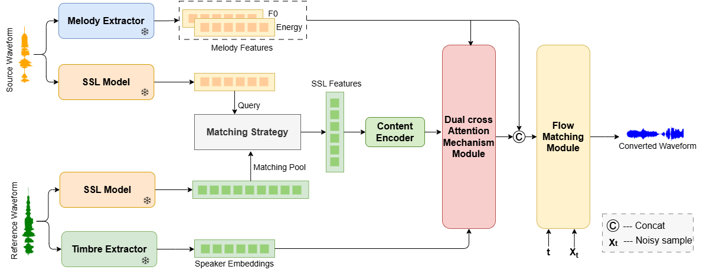
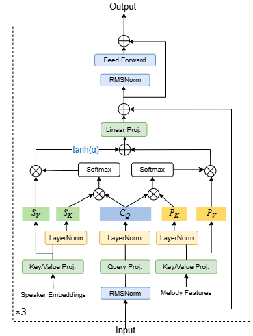

## Abstract

Singing Voice Conversion (SVC) transfers a source singer’s timbre to a target while keeping melody and lyrics. The key challenge in any-to-any SVC is adapting unseen speaker timbres to source audio without quality degradation. Existing methods either face timbre leakage or fail to achieve satisfactory timbre similarity and quality in the generated audio. To address these challenges, we propose DAFMSVC, where the self-supervised learning (SSL) features from the source audio are replaced with the most similar SSL features from the target audio to prevent timbre leakage. It also incorporates a dual-cross-attention mechanism for the adaptive fusion of speaker embeddings, melody, and linguistic content. Additionally, we introduce a flow matching module for high-quality audio generation from the fused features. Experimental results show that DAFMSVC significantly enhances timbre similarity and naturalness, outperforming state-of-the-art methods in both subjective and objective evaluations.
 
 

    <figure style="text-align: center;">
        
		<figcaption style="text-align: center;">
            <strong>DAFMSVC framework.</strong> 
            <small>Snowflake represents the parameter that remains unchanged when training the framework.</small>
        </figcaption>
    </figure>
    <figure style="text-align: center;">
        
        <figcaption style="text-align: center;"><strong>Melody extractor.</strong></figcaption>
    </figure>

## Conversion Tasks

Our goal is to transfer the timbre of a source song to an unseen target singer while preserving the original content and melody.
We will generate waveforms with high timbre similarity, naturalness and quality.
Note that the reference audio in the SVC demo is approximately 30 seconds long. In the demo web, we have only included about 10 seconds of the target person's audio to demonstrate their voice characteristics.

- **Proposed** - the DAFMSVC method.
- **NeuCoSVC** - This method is a novel neural concatenation-based approach for one-shot SVC, which adopts the FastSVC architecture to generate synthesized audio.
- **So-VITS-SVC** - This method is a popular open-source voice conversion tool based on VITS, which uses a Conditional Variational Autoencoder combined with adversarial learning.
- **DDSP-SVC** - This method is an end-to-end singing voice conversion system based on Differentiable Digital Signal Processing (DDSP) that uses a cascade diffusion model to reconstruct high-quality audio.

## Demos

<table>
<thead>
<tr class="header">
<th>NO</th>
<th>Source</th>
<th>Reference</th>
<th>Proposed</th>
<th>NeuCoSVC</th>
<th>So-VITS-SVC</th>
<th>DDSP-SVC</th>

</tr>
</thead>
<tbody>
<tr class="odd">
<td>1</td>
<td><audio controls>
				<source src="audios\example\gt\ManRaw_1_达尔文_11.wav" type="audio/mpeg">
				Your browser does not support this audio format.
			</audio></td>
<td rowspan="2"><audio controls>
				<source src="audios\example\ref\M26_ref.wav" type="audio/mpeg">
				Your browser does not support this audio format.
			</audio></td>
<td><audio controls>
				<source src="audios\example\pro_infer\ManRaw_1_达尔文_11_to_M_26_26.wav" type="audio/mpeg">
				Your browser does not support this audio format.
			</audio></td>
<td><audio controls>
				<source src="audios\example\neuco_infer\ManRaw_1_达尔文_11_to_M_26_26.wav" type="audio/mpeg">
				Your browser does not support this audio format.
			</audio></td>
<td><audio controls>
				<source src="audios\example\sovits_infer\ManRaw_1_达尔文_11_to_M_26_26.wav" type="audio/mpeg">
				Your browser does not support this audio format.
			</audio></td>
<td><audio controls>
				<source src="audios\example\ddsp_infer\ManRaw_1_达尔文_11_to_M_26_26.wav" type="audio/mpeg">
				Your browser does not support this audio format.
			</audio></td>
</tr>

<tr class="odd">
<td>2</td>
<td><audio controls>
				<source src="audios\example\gt\WomanRaw_37_需要人陪_15.wav" type="audio/mpeg">
				Your browser does not support this audio format.
			</audio></td>
<td><audio controls>
				<source src="audios\example\pro_infer\WomanRaw_37_需要人陪_15_to_M_26_26.wav" type="audio/mpeg">
				Your browser does not support this audio format.
			</audio></td>
<td><audio controls>
				<source src="audios\example\neuco_infer\WomanRaw_37_需要人陪_15_to_M_26_26.wav" type="audio/mpeg">
				Your browser does not support this audio format.
			</audio></td>
<td><audio controls>
				<source src="audios\example\sovits_infer\WomanRaw_37_需要人陪_15_to_M_26_26.wav" type="audio/mpeg">
				Your browser does not support this audio format.
			</audio></td>
<td><audio controls>
				<source src="audios\example\ddsp_infer\WomanRaw_37_需要人陪_15_to_M_26_26.wav" type="audio/mpeg">
				Your browser does not support this audio format.
			</audio></td>
</tr>

<tr class="odd">
<td>3</td>
<td><audio controls>
				<source src="audios\example\gt\ManRaw_17_方圆几里_29.wav" type="audio/mpeg">
				Your browser does not support this audio format.
			</audio></td>
<td><audio controls>
				<source src="audios\example\ref\M27_ref.wav" type="audio/mpeg">
				Your browser does not support this audio format.
			</audio></td>
<td><audio controls>
				<source src="audios\example\pro_infer\ManRaw_17_方圆几里_29_to_M_27_27.wav" type="audio/mpeg">
				Your browser does not support this audio format.
			</audio></td>
<td><audio controls>
				<source src="audios\example\neuco_infer\ManRaw_17_方圆几里_29_to_M_27_27.wav" type="audio/mpeg">
				Your browser does not support this audio format.
			</audio></td>
<td><audio controls>
				<source src="audios\example\sovits_infer\ManRaw_17_方圆几里_29_to_M_27_27.wav" type="audio/mpeg">
				Your browser does not support this audio format.
			</audio></td>
<td><audio controls>
				<source src="audios\example\ddsp_infer\ManRaw_17_方圆几里_29_to_M_27_27.wav" type="audio/mpeg">
				Your browser does not support this audio format.
			</audio></td>
</tr>

<tr class="odd">
<td>4</td>
<td><audio controls>
				<source src="audios\example\gt\WomanRaw_6_爱笑的眼睛_40.wav" type="audio/mpeg">
				Your browser does not support this audio format.
			</audio></td>
<td rowspan="2"><audio controls>
				<source src="audios\example\ref\W46_ref.wav" type="audio/mpeg">
				Your browser does not support this audio format.
			</audio></td>
<td><audio controls>
				<source src="audios\example\pro_infer\WomanRaw_6_爱笑的眼睛_40_to_W_46_46.wav" type="audio/mpeg">
				Your browser does not support this audio format.
			</audio></td>
<td><audio controls>
				<source src="audios\example\neuco_infer\WomanRaw_6_爱笑的眼睛_40_to_W_46_46.wav" type="audio/mpeg">
				Your browser does not support this audio format.
			</audio></td>
<td><audio controls>
				<source src="audios\example\sovits_infer\WomanRaw_6_爱笑的眼睛_40_to_W_46_46.wav" type="audio/mpeg">
				Your browser does not support this audio format.
			</audio></td>
<td><audio controls>
				<source src="audios\example\ddsp_infer\WomanRaw_6_爱笑的眼睛_40_to_W_46_46.wav" type="audio/mpeg">
				Your browser does not support this audio format.
			</audio></td>
</tr>

<tr class="odd">
<td>5</td>
<td><audio controls>
				<source src="audios\example\gt\WomanRaw_16_光_9.wav" type="audio/mpeg">
				Your browser does not support this audio format.
			</audio></td>
<td><audio controls>
				<source src="audios\example\pro_infer\WomanRaw_16_光_9_to_W_46_46.wav" type="audio/mpeg">
				Your browser does not support this audio format.
			</audio></td>
<td><audio controls>
				<source src="audios\example\neuco_infer\WomanRaw_16_光_9_to_W_46_46.wav" type="audio/mpeg">
				Your browser does not support this audio format.
			</audio></td>
<td><audio controls>
				<source src="audios\example\sovits_infer\WomanRaw_16_光_9_to_W_46_46.wav" type="audio/mpeg">
				Your browser does not support this audio format.
			</audio></td>
<td><audio controls>
				<source src="audios\example\ddsp_infer\WomanRaw_16_光_9_to_W_46_46.wav" type="audio/mpeg">
				Your browser does not support this audio format.
			</audio></td>
</tr>

<tr class="odd">
<td>6</td>
<td><audio controls>
				<source src="audios\example\gt\WomanRaw_25_易燃易爆炸_25.wav" type="audio/mpeg">
				Your browser does not support this audio format.
			</audio></td>
<td rowspan="2"><audio controls>
				<source src="audios\example\ref\W47_ref.wav" type="audio/mpeg">
				Your browser does not support this audio format.
			</audio></td>
<td><audio controls>
				<source src="audios\example\pro_infer\WomanRaw_25_易燃易爆炸_25_to_W_47_47.wav" type="audio/mpeg">
				Your browser does not support this audio format.
			</audio></td>
<td><audio controls>
				<source src="audios\example\neuco_infer\WomanRaw_25_易燃易爆炸_25_to_W_47_47.wav" type="audio/mpeg">
				Your browser does not support this audio format.
			</audio></td>
<td><audio controls>
				<source src="audios\example\sovits_infer\WomanRaw_25_易燃易爆炸_25_to_W_47_47.wav" type="audio/mpeg">
				Your browser does not support this audio format.
			</audio></td>
<td><audio controls>
				<source src="audios\example\ddsp_infer\WomanRaw_25_易燃易爆炸_25_to_W_47_47.wav" type="audio/mpeg">
				Your browser does not support this audio format.
			</audio></td>
</tr>

<tr class="odd">
<td>7</td>
<td><audio controls>
				<source src="audios\example\gt\WomanRaw_1_大鱼_9.wav" type="audio/mpeg">
				Your browser does not support this audio format.
			</audio></td>
<td><audio controls>
				<source src="audios\example\pro_infer\WomanRaw_1_大鱼_9_to_W_47_47.wav" type="audio/mpeg">
				Your browser does not support this audio format.
			</audio></td>
<td><audio controls>
				<source src="audios\example\neuco_infer\WomanRaw_1_大鱼_9_to_W_47_47.wav" type="audio/mpeg">
				Your browser does not support this audio format.
			</audio></td>
<td><audio controls>
				<source src="audios\example\sovits_infer\WomanRaw_1_大鱼_9_to_W_47_47.wav" type="audio/mpeg">
				Your browser does not support this audio format.
			</audio></td>
<td><audio controls>
				<source src="audios\example\ddsp_infer\WomanRaw_1_大鱼_9_to_W_47_47.wav" type="audio/mpeg">
				Your browser does not support this audio format.
			</audio></td>
</tr>

</tbody>
</table>

  

  
   
   
